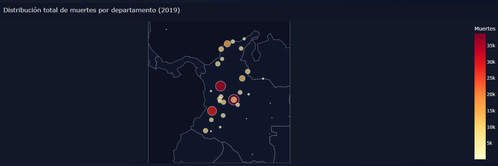
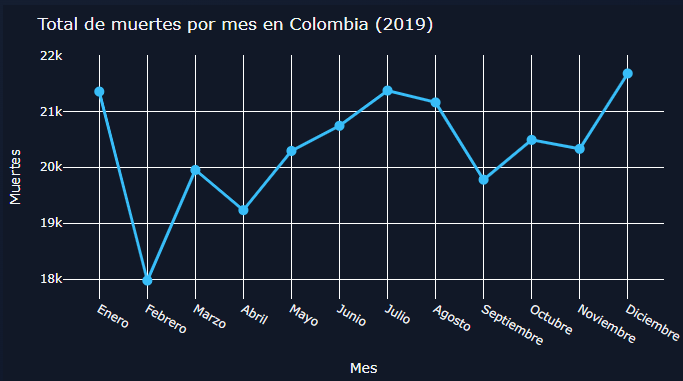
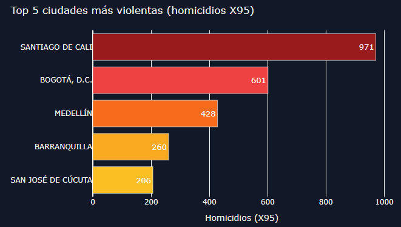
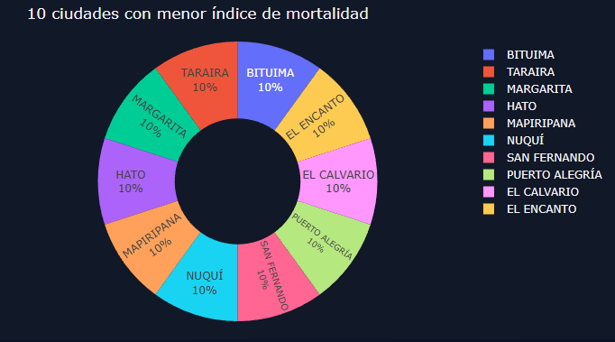
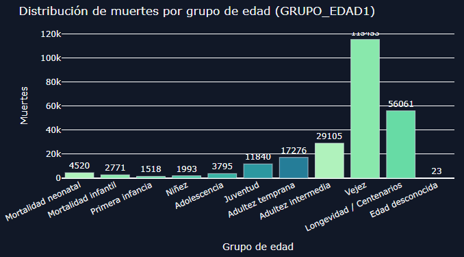
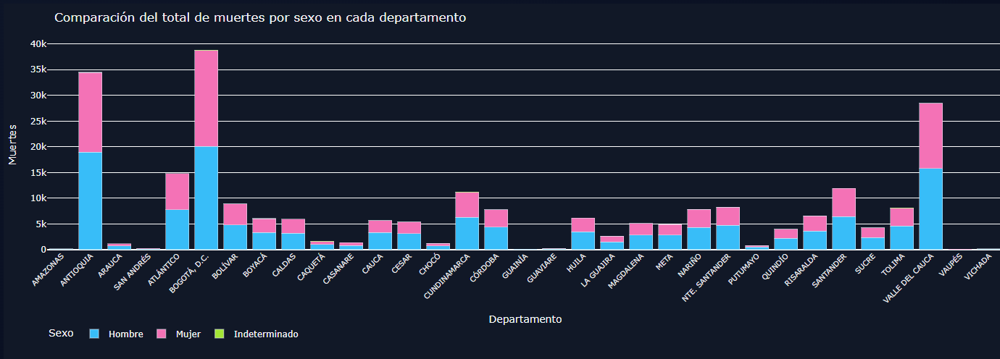
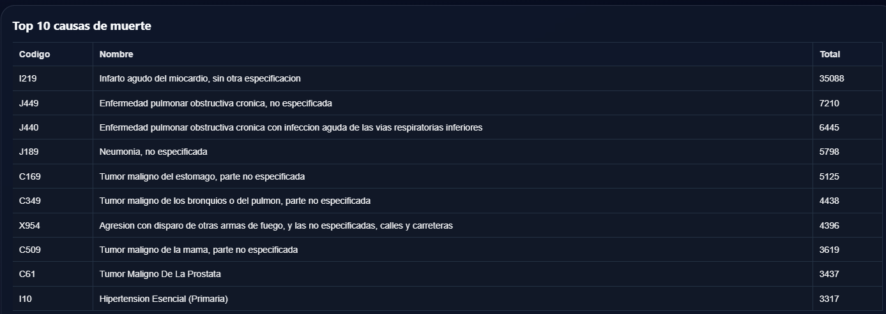

# 📊 Mortalidad en Colombia 2019 — Dashboard Interactivo

> Aplicación web dinámica desarrollada en Python con Dash y Plotly para explorar y analizar los datos de mortalidad no fetal en Colombia durante el año 2019, a partir de los microdatos oficiales del DANE.

---

## 🌐 Enlaces

| Recurso | URL |
|---------|-----|
| **Aplicación desplegada** | [analisis-mortalidad-colombia.onrender.com](https://analisis-mortalidad-colombia.onrender.com) |
| **Repositorio GitHub** | [github.com/andresp26/analisis-mortalidad-colombia](https://github.com/andresp26/analisis-mortalidad-colombia) |

---

## 👥 Integrantes

- **Plinio Andrés Hernández**
- **Jherson Guzmán Ramírez**

**Asignatura:** Aplicaciones 1 — Actividad 4  
**Universidad:** Universidad de La Salle

---

## 🎯 Objetivo

Analizar la distribución de la mortalidad en Colombia por departamento, mes, ciudad, sexo, causa de muerte y grupo de edad, proporcionando una herramienta accesible para identificar patrones demográficos y regionales.

---

## 🖥️ Visualizaciones implementadas

| # | Tipo de gráfico | Descripción |
|---|----------------|-------------|
| 1 | **Mapa geográfico** | Distribución total de muertes por departamento en Colombia (2019) |
| 2 | **Gráfico de líneas** | Total de muertes por mes, mostrando variaciones a lo largo del año |
| 3 | **Gráfico de barras** | Top 5 ciudades más violentas (homicidios con código X95 — agresión con armas de fuego) |
| 4 | **Gráfico circular** | 10 ciudades con menor índice de mortalidad |
| 5 | **Tabla** | 10 principales causas de muerte (código CIE-10, nombre y total de casos, orden descendente) |
| 6 | **Barras apiladas** | Comparación del total de muertes por sexo en cada departamento |
| 7 | **Histograma** | Distribución de muertes por grupo de edad según la variable GRUPO_EDAD1 |

### Categorías de edad (GRUPO_EDAD1)

| Categoría | Códigos DANE | Rango de edad |
|-----------|:------------:|---------------|
| Mortalidad neonatal | 0–4 | Menor de 1 mes |
| Mortalidad infantil | 5–6 | 1 a 11 meses |
| Primera infancia | 7–8 | 1 a 4 años |
| Niñez | 9–10 | 5 a 14 años |
| Adolescencia | 11 | 15 a 19 años |
| Juventud | 12–13 | 20 a 29 años |
| Adultez temprana | 14–16 | 30 a 44 años |
| Adultez intermedia | 17–19 | 45 a 59 años |
| Vejez | 20–24 | 60 a 84 años |
| Longevidad / Centenarios | 25–28 | 85 a 100+ años |
| Edad desconocida | 29 | Sin información |

---

## 🏗️ Estructura del proyecto

```
├── app.py                  # Aplicación principal (Dash + Plotly)
├── convert_to_parquet.py   # Script de conversión Excel → Parquet
├── requirements.txt        # Dependencias de Python
├── Procfile                # Comando de arranque (gunicorn)
├── render.yaml             # Configuración de despliegue en Render
├── assets/
│   └── styles.css          # Estilos del dashboard (tema oscuro)
└── data/
    ├── NoFetal2019.parquet       # Microdatos de mortalidad 2019
    ├── CodigosDeMuerte.parquet   # Catálogo CIE-10 de causas de muerte
    └── Divipola.parquet          # División político-administrativa (DANE)
```

---

## ⚙️ Tecnologías utilizadas

| Tecnología | Propósito |
|-----------|-----------|
| **Python 3.11** | Lenguaje principal |
| **Dash** | Framework web para dashboards interactivos |
| **Plotly** | Librería de visualización de datos |
| **Pandas** | Manipulación y análisis de datos |
| **PyArrow / Parquet** | Formato de datos optimizado para carga rápida |
| **Gunicorn** | Servidor WSGI para producción |
| **Render** | Plataforma de despliegue (PaaS) |

---

## 🚀 Instalación local

```bash
# 1. Clonar el repositorio
git clone https://github.com/andresp26/analisis-mortalidad-colombia.git
cd analisis-mortalidad-colombia

# 2. Crear y activar entorno virtual
python -m venv .venv
.venv\Scripts\activate        # Windows
# source .venv/bin/activate   # Linux/Mac

# 3. Instalar dependencias
pip install -r requirements.txt

# 4. Ejecutar la aplicación
python app.py
```

La aplicación estará disponible en `http://localhost:8050`

---

## ☁️ Despliegue en Render

1. Crear cuenta en [render.com](https://render.com) y conectar con GitHub.
2. Crear un **Web Service** y seleccionar el repositorio.
3. Render detecta automáticamente el archivo `render.yaml` con la configuración:
   - **Build Command:** `pip install -r requirements.txt`
   - **Start Command:** `gunicorn app:server`
   - **Instance Type:** Free
4. El despliegue se ejecuta automáticamente con cada push a `master`.

---

## 📁 Fuentes de datos

| Archivo | Descripción | Fuente |
|---------|-------------|--------|
| `NoFetal2019.parquet` | Registros individuales de defunciones no fetales 2019 | DANE — Estadísticas Vitales |
| `CodigosDeMuerte.parquet` | Catálogo de códigos CIE-10 con descripciones | DANE / OMS |
| `Divipola.parquet` | Códigos y nombres de departamentos y municipios | DANE — DIVIPOLA |

---

## 📝 Notas técnicas

- Los datos originales en formato Excel fueron convertidos a **Parquet** para optimizar el tiempo de carga (~10x más rápido).
- El script `convert_to_parquet.py` permite regenerar los archivos Parquet a partir de los Excel originales si es necesario.
- La aplicación incluye un filtro interactivo por departamento que actualiza todas las visualizaciones en tiempo real.
- En el tier gratuito de Render, la instancia se suspende tras 15 minutos de inactividad. La primera visita puede tardar ~30 segundos en despertar.

---

## 📈 Visualizaciones y hallazgos

A continuación se presentan las capturas de pantalla de cada visualización junto con la interpretación de los resultados obtenidos.

---

### 1. Mapa — Distribución total de muertes por departamento (2019)



**Hallazgo principal:** Bogotá D.C. es el departamento con mayor número de defunciones registradas (más de 35,000), seguido por Antioquia y Valle del Cauca. Esto se correlaciona directamente con la densidad poblacional de estos territorios. Los departamentos del suroriente (Amazonas, Vaupés, Guainía) presentan los menores registros, lo cual es consistente con su baja densidad demográfica. La concentración de mortalidad en la zona andina y caribeña refleja la distribución poblacional del país.

---

### 2. Gráfico de líneas — Total de muertes por mes



**Hallazgo principal:** Diciembre es el mes con mayor mortalidad (~21,700 defunciones), mientras que febrero registra el valor más bajo (~18,000). Se observa un patrón con dos picos: uno en enero (posiblemente asociado a condiciones climáticas y festividades de fin de año) y otro entre julio-agosto. La tendencia general muestra un incremento progresivo desde febrero hasta julio, un descenso en septiembre, y un nuevo ascenso hacia diciembre. La diferencia entre el mes más letal y el menos letal es de aproximadamente 3,700 defunciones.

---

### 3. Gráfico de barras — Top 5 ciudades más violentas (homicidios X95)



**Hallazgo principal:** Santiago de Cali lidera con 971 homicidios por arma de fuego (código X95), casi duplicando a Bogotá D.C. (601). Le siguen Medellín (428), Barranquilla (260) y San José de Cúcuta (206). Cali concentra el 10.5% del total de homicidios X95 del país (9,273 total), lo que evidencia una problemática de violencia armada particularmente grave en esta ciudad. La presencia de Cúcuta en el top 5 puede estar relacionada con su condición de ciudad fronteriza.

---

### 4. Gráfico circular — 10 ciudades con menor índice de mortalidad



**Hallazgo principal:** Los 10 municipios con menor número de defunciones registradas son: Bituima, Taraira, Margarita, El Encanto, Hato, Mapiripana, Nuquí, San Fernando, Puerto Alegría y El Calvario. Todos presentan una proporción equitativa (10% cada uno), lo que indica que registraron el mismo número mínimo de defunciones. Estos municipios comparten características comunes: son territorios rurales, de difícil acceso geográfico y con poblaciones muy reducidas, ubicados principalmente en departamentos como Vaupés, Amazonas, Guainía y Chocó.

---

### 5. Histograma — Distribución de muertes por grupo de edad (GRUPO_EDAD1)



**Hallazgo principal:** La vejez (60-84 años) concentra la mayor cantidad de defunciones con 119,433 casos (48.9% del total), seguida por longevidad/centenarios (85-100+ años) con 56,061 casos (22.9%). Juntos, los mayores de 60 años representan el 71.8% de todas las muertes. La adultez intermedia (45-59 años) aporta 29,105 casos. En contraste, la mortalidad en menores de 14 años es relativamente baja (mortalidad neonatal: 4,520; infantil: 2,771; primera infancia: 1,518; niñez: 1,993), lo que refleja avances en salud materno-infantil. La adolescencia (3,795) y juventud (11,840) muestran valores intermedios, donde la violencia es un factor contribuyente significativo.

---

### 6. Barras apiladas — Comparación del total de muertes por sexo en cada departamento



**Hallazgo principal:** En la mayoría de los departamentos, la mortalidad masculina supera a la femenina. Bogotá D.C. presenta el mayor volumen total (~39,000), seguido de Antioquia (~35,000) y Valle del Cauca (~29,000). La brecha entre sexos es más pronunciada en departamentos con alta violencia: en Antioquia y Valle del Cauca, los hombres representan aproximadamente el 55-57% de las defunciones. Esta diferencia se explica por la mayor exposición masculina a causas externas (homicidios, accidentes de tránsito). Los casos de sexo indeterminado son marginales y apenas visibles en la gráfica.

---

### 7. Tabla — Top 10 principales causas de muerte



**Hallazgo principal:** El infarto agudo del miocardio (I219) es la principal causa de muerte con 35,088 casos, representando el 14.4% del total nacional. Le siguen las enfermedades respiratorias crónicas: EPOC no especificada (J449: 7,210) y EPOC con infección aguda (J440: 6,445). La neumonía (J189: 5,798) ocupa el cuarto lugar. Los tumores malignos aparecen en múltiples posiciones: estómago (C169: 5,125), pulmón (C349: 4,438), mama (C509: 3,619) y próstata (C61: 3,437). Destaca la presencia de agresión con arma de fuego (X954: 4,396) en el séptimo lugar, evidenciando el impacto de la violencia como causa de muerte en Colombia. La hipertensión esencial (I10: 3,317) cierra el top 10.

---

*Desarrollado como parte de la Actividad 4 — Aplicaciones 1, Universidad de La Salle.*
